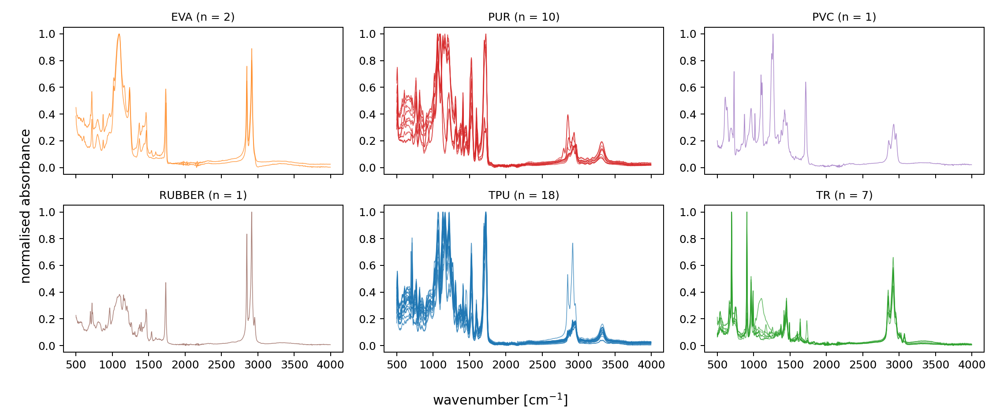
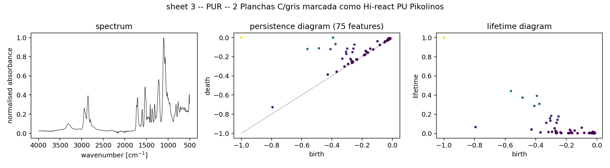
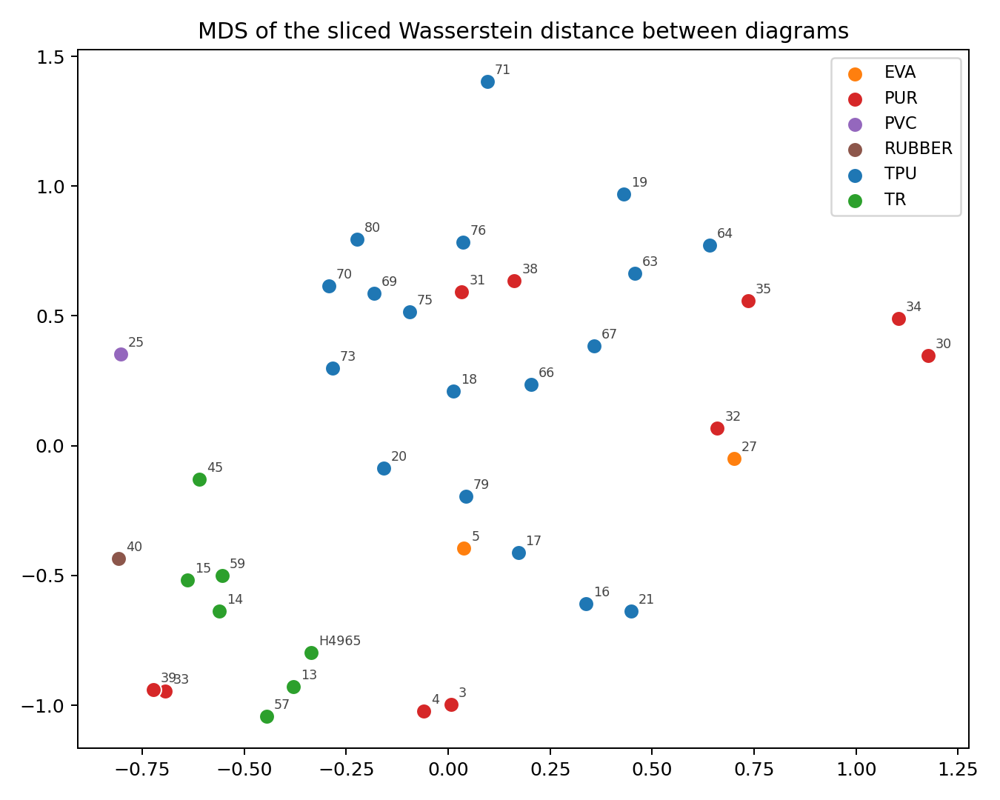

# Topological characterisation of shoe-sole materials from IR/ATR spectra

## 1. Objective

Characterise 39 composite materials from their infrared spectrum using
persistence diagrams, following the methodology of Frahi, Falcó, Chinesta and
co-workers, and establish whether the topological descriptors recover the
material families without being told what they are.

## 2. Data

The source is the results workbook of the study *Caracterización de suelas de
calzado* (Universidad de Alicante, 2021). Each of its 39 worksheets holds the
IR/ATR spectrum of one material reference: about 4 600 points between 499 and
4 000 cm⁻¹, sampled at roughly 0.96 cm⁻¹. Spectra are interpolated onto a
common grid of 3 600 points spanning 500–3 996 cm⁻¹, the range shared by every
worksheet.

The material family is read off the supplier description in
`references.txt`:

| Family | n | Description |
|---|---|---|
| TPU | 18 | thermoplastic polyurethane |
| PUR | 10 | cast / expanded polyurethane |
| TR | 7 | thermoplastic rubber |
| EVA | 2 | ethylene-vinyl acetate |
| PVC | 1 | poly(vinyl chloride) |
| RUBBER | 1 | natural rubber, latex |

The imbalance matters for what follows. Four of the six families have one or two
members, so a clustering can only be scored fairly on TPU, PUR and TR; both the
full set and that 35-sample subset are reported.

ATR absorbance depends on the contact pressure between sample and crystal, so
the absolute scale carries no material information. Spectra are rescaled to
[0, 1] before any topology is computed — persistence values inherit the units of
the filtration function, so this is not cosmetic.

## 3. Method

### 3.1 From a spectrum to a persistence diagram

A spectrum is a function on a line, not a point cloud, and for such a function
the Vietoris–Rips filtration used in the reference papers collapses to something
much simpler. The degree-0 diagram of the superlevel-set filtration is exactly
the "one-to-one local-minimum/local-maximum pairing" of the tape-surfaces paper:
sweep a horizontal line downwards through the spectrum, open a connected
component at every absorption maximum it meets, and close the younger of two
components whenever they merge at a minimum. This is computed in `O(n log n)`
with a union-find structure in `src/irtda/persistence.py`; no external topology
library is required, and the result is exact rather than an approximation on a
subsampled complex.

The reading is directly chemical. Every point of the diagram is one absorption
band; its birth is the band height and **its persistence is the topological
prominence of the band** — how far the absorbance must drop before that band
stops being a separate feature. Shoulders on a strong band appear as
low-persistence points near the diagonal, isolated bands as points far from it.

Diagrams hold about 200 points each, of which roughly 70 survive pruning.
Features whose prominence falls below the noise floor are discarded: the
threshold is the larger of 2·10⁻³ and four standard deviations of the noise,
estimated per spectrum from the median absolute deviation of the second
difference. On this data the noise term never binds — the spectra are clean —
but it becomes decisive in §5.

### 3.2 Two vectorisations

The lifetime diagram `T(a, b) = (a, b − a)` is convolved with an isotropic
Gaussian, weighted by a linear ramp in the lifetime, and integrated over the
cells of a 20 × 20 grid. Pixel values are computed exactly from the Gaussian
CDF rather than by sampling the density at pixel centres, which keeps the
representation stable when the kernel is narrow relative to a pixel.

This gives **PI**, the persistence image of the reference papers. It has a
property worth stating plainly: *the persistence diagram of a one-dimensional
filtration is invariant under any reparametrisation of the domain*. Stretch the
wavenumber axis, or permute whole regions of the spectrum, and the diagram does
not move. For a rough surface profile or a robot trajectory that invariance is
the point. For a vibrational spectrum it discards the single most informative
thing in the measurement, because the position of a band *is* its chemical
identity.

So a second descriptor is introduced here: **TFI**, a *topological fingerprint
image*, built over `(wavenumber, lifetime)` instead of `(birth, lifetime)`. The
horizontal coordinate of each feature becomes the wavenumber of the maximum
that generated it. Prominence — the robust, baseline-insensitive quantity that
persistence supplies — is kept; position is restored.

Diagrams are also compared directly with the sliced Wasserstein distance
(Carrière, Cuturi and Oudot, 2017), which augments each diagram with the
diagonal projections of the other, projects both onto a family of directions and
averages the resulting one-dimensional Wasserstein distances. It is a proper
metric and cheap enough for all 741 pairs. The exact optimal-matching
Wasserstein distance is also implemented, for use on pruned diagrams.

## 4. Unsupervised grouping

Each representation is clustered under an identical protocol and scored against
the material families with the adjusted Rand index (ARI) and adjusted mutual
information (AMI). Both are corrected for chance: 0 means no better than a
random partition. **The labels never enter the clustering.**

| Subset | Representation | ARI | AMI | silhouette |
|---|---|---|---|---|
| all (n=39, k=6) | PI, *k*-means | 0.343 | 0.420 | 0.218 |
| | TFI, *k*-means | 0.332 | 0.460 | 0.336 |
| | sliced Wasserstein, average linkage | 0.305 | 0.396 | 0.229 |
| | baseline: raw spectra, *k*-means | **0.570** | **0.667** | 0.564 |
| TPU/PUR/TR (n=35, k=3) | PI, *k*-means | 0.274 | 0.369 | 0.238 |
| | TFI, *k*-means | 0.373 | 0.515 | 0.356 |
| | sliced Wasserstein, average linkage | 0.285 | 0.282 | 0.289 |
| | baseline: raw spectra, *k*-means | **0.558** | **0.662** | 0.660 |

Three things are worth reading out of this table.

**TR separates perfectly, and every method finds it.** All seven thermoplastic
rubbers form one cluster containing nothing else, under every representation.
They are the only non-polyurethane family with replicates, and they are
unambiguous.

**The TPU/PUR boundary is where everything fails, and that is chemically
expected.** Both families are polyurethanes; TPU is the thermoplastic form and
PUR the cast or expanded form of the same chemistry. Their infrared spectra are
dominated by the same N–H, C=O and C–O–C bands. The TFI contingency table

|  | C0 | C1 | C2 |
|---|---|---|---|
| PUR | 0 | 2 | 8 |
| TPU | 0 | 11 | 7 |
| TR | 7 | 0 | 0 |

shows a real but partial separation. The baseline does not separate them either;
it simply splits PUR in two and keeps TPU intact, which happens to score better
without corresponding to a cleaner chemical distinction.

**Adding position to the diagram helps, in the way predicted.** On the
TPU/PUR/TR subset the TFI raises the ARI from 0.274 to 0.373 and the AMI from
0.369 to 0.515 over the classical persistence image. The improvement survives
the whole hyper-parameter grid swept in step 5 — pruning threshold 10⁻³–10⁻²,
resolution 16–64 pixels, kernel width 10–40 cm⁻¹ — over which the ARI takes only
two values, 0.373 in 53 of the 60 configurations and 0.278 in the rest. That
insensitivity is itself a result: there is nothing to tune here, and the score
reported above is not the product of a search.

**The raw spectra win on this data set.** A *k*-means on 3 600 SNV-corrected
absorbance values scores 0.56, well above every topological descriptor. This
deserves a direct explanation rather than a hedge, and §5 gives one.

## 5. Why the baseline wins here, and when it stops winning

All 39 spectra were acquired on one instrument, in one campaign, on one
calibration. They are already aligned to better than the sampling interval and
share a common baseline treatment. Under those conditions a point-by-point
comparison is close to optimal, and the invariances that persistence buys are
invariances to variation this data set does not contain. Reporting that the
baseline wins and stopping there would be measuring the wrong thing.

The claim made for topological descriptors in the reference papers is
specifically about *misalignment*: two signals that describe the same system in
similar conditions never match perfectly, and a metric that requires them to is
fragile. That claim is testable here. Four artefacts routine in ATR practice
were simulated at increasing amplitude — a smooth quadratic baseline drift, a
rigid shift of the wavenumber axis, additive white noise, and a smooth
multiplicative envelope from variable contact pressure. Each perturbed spectrum
is then matched back against the *unperturbed* library by nearest neighbour. The
score is the fraction of spectra that retrieve themselves: no labels are needed,
and it measures precisely whether a representation can still identify a material
after the artefact.

| Artefact, at maximum amplitude | raw spectra | PI | TFI |
|---|---|---|---|
| baseline drift, 0.4 of the absorbance range | 0.48 | 0.39 | 0.46 |
| **wavenumber shift, ±16 cm⁻¹** | **0.68** | **1.00** | **0.99** |
| additive noise, 0.05 of the range | 0.98 | 0.03 | 0.38 |
| intensity envelope, ±50 % | 0.43 | 0.14 | 0.25 |

**The wavenumber shift reverses the ordering completely.** At ±16 cm⁻¹ the raw
spectra identify 68 % of the materials; the persistence image identifies 100 %,
and does so at every amplitude tested, because the diagram is exactly invariant
under reparametrisation of the axis. The TFI holds 99 %: it gives up strict
invariance in exchange for chemical information and loses almost nothing. This
is the regime the method was designed for — spectra pooled across instruments,
laboratories or calibrations — and in it topology is not a marginal improvement
but a categorical one.

**Additive noise is where the topological descriptors are genuinely weak.**
Averaging over 3 600 channels suppresses white noise, so the raw spectra barely
notice it; a persistence diagram, by contrast, gains a spurious feature at every
noise-induced local maximum. With a fixed pruning threshold the persistence
image collapses to 3 % self-retrieval at 1.25 % noise. This is a defect of the
threshold, not of the method, and it is worth separating the two: with the
threshold tied to a per-spectrum noise estimate the TFI recovers to 89 % at that
level and 38 % at the highest, against 16 % for the fixed threshold. The
adaptive rule is the default in the library for this reason. Even so, noise
remains the artefact these descriptors handle worst, and a spectrum that is
noisy enough should be smoothed before its topology is computed.

Baseline drift and the intensity envelope fall in between, with the TFI tracking
the baseline closely on the former and both trailing on the latter.

## 6. Conclusions

1. The persistent-homology workflow of Frahi *et al.* transfers to IR spectra
   with a considerable simplification: for a one-dimensional filtration the
   degree-0 diagram is an exact union-find computation, and the Rips machinery
   is unnecessary.
2. Persistence of a feature reads as the prominence of an absorption band,
   which makes the descriptor interpretable rather than merely predictive.
3. The classical persistence image discards band positions, and for
   spectroscopy that is the wrong invariance. The position-aware variant
   proposed here (TFI) raises the ARI from 0.27 to 0.37 on the polyurethane /
   rubber subset and is insensitive to its hyper-parameters.
4. On clean, single-instrument data the raw spectra remain the stronger
   representation. Under a wavenumber miscalibration the ordering reverses
   decisively (1.00 against 0.68 at ±16 cm⁻¹). The case for topology here is
   robustness to acquisition conditions, not accuracy in nominal ones.
5. TR is cleanly separable from the polyurethanes by every method. TPU and PUR
   are not cleanly separable by any of them, which is what the chemistry
   predicts.

## 7. Limitations and next steps

- **39 samples, one spectrum each.** No replicates, so within-material
  variability cannot be estimated and supervised classification is not
  meaningful. The tape-surfaces paper had 800 profiles from 16 surfaces; the
  analogous move here is to acquire several spectra per reference, which would
  also allow the sliding-window protocol of the driver-assistance paper.
- **The families are inferred from free-text supplier descriptions**, not from
  independent chemical analysis. The workbook also contains thermogravimetric
  and EGA/Py/GC/MS results that could confirm them, and that this analysis does
  not touch.
- **Only degree-0 homology is used.** Embedding the spectrum as a point cloud
  in the plane, or by time-delay embedding, would give H₁ features; whether
  loops in such an embedding carry chemical meaning is an open question.
- **The multi-modal route is untouched.** Persistence diagrams of the TG and
  DTG curves in the same workbook could be concatenated with the spectral ones,
  which is the natural way to separate TPU from PUR where infrared alone
  cannot.

## References

1. T. Frahi, C. Argerich, M. Yun, A. Falcó, A. Barasinski, F. Chinesta.
   *Tape surfaces characterization with persistence images*.
   AIMS Materials Science 7(4):364–380, 2020.
2. T. Frahi, F. Chinesta, A. Falcó, A. Badias, E. Cueto, H. Y. Choi, M. Han,
   J.-L. Duval. *Empowering Advanced Driver-Assistance Systems from Topological
   Data Analysis*. Mathematics 9:634, 2021.
3. T. Frahi, A. Falcó, B. Vinh Mau, J. L. Duval, F. Chinesta. *Empowering
   Advanced Parametric Modes Clustering from Topological Data Analysis*.
   Applied Sciences 11:6554, 2021.
4. T. Frahi, A. Sancarlos, M. Galle, X. Beaulieu, A. Chambard, A. Falcó,
   E. Cueto, F. Chinesta. *Monitoring Weeder Robots and Anticipating Their
   Functioning by Using Advanced Topological Data Analysis*.
   Frontiers in Artificial Intelligence 4:761123, 2021.
5. M. Carrière, M. Cuturi, S. Oudot. *Sliced Wasserstein Kernel for Persistence
   Diagrams*. ICML, 2017.
6. I. Blasco López, A. F. Marcilla Gomis. *Caracterización de suelas de
   calzado*. Informe final, Universidad de Alicante, 2021.
